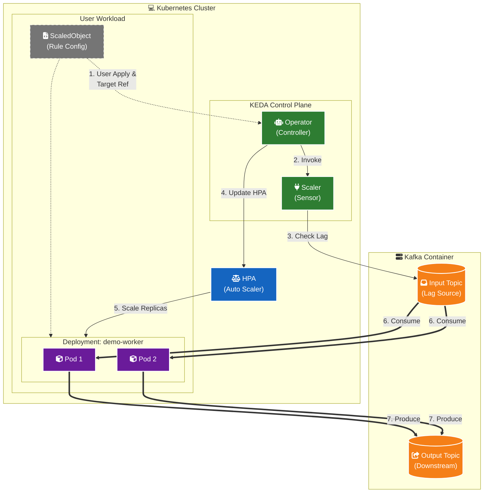

# KEDA Kafka Autoscaling Lab (Serverless Event-Driven) #
 
 

> 這是一個基於 **Kubernetes (KEDA)** 與 **Apache Kafka** 的自動擴縮容 (Auto-scaling) 實戰專案。
 主要演示如何讓 .NET Worker 根據 Kafka Topic 的積壓量 (Lag) 自動從 0 擴展到多個 Pods，
 並在處理完畢後自動縮容回 0 (Scale-to-Zero)，實現類似 Serverless 的資源管理。

---
###### 實作影片 (Experimental Video)
[_Demo_Video-blue?style=for-the-badge&logo=youtube)](https://pub-05c62739ac6f4499a3401b26d0e9faaf.r2.dev/video/KEDA_LabVedio.mp4)

---
###### 系統架構 (Architecture)
*本專案運行於本地開發環境 (Mac mini + OrbStack)，模擬生產環境的事件驅動架構。*

---
###### 專案動機 (前情提要)
本專案主要目標為達成以下兩點技術驗證：

1.  **提升 Kubernetes 實戰熟悉度**：
    * 實作 *Deployment* 的宣告式組態管理 (Declarative Configuration)。
    * 觀察 *HPA (Horizontal Pod Autoscaler)* 如何被外部事件觸發並動態調整 Pod 數量。
    * 解決開發環境下的 *跨網路通訊問題*：讓 K8s Pod 內的應用程式能順利連線至宿主機 (Host) 上的 Kafka 服務 (`host.docker.internal` 解析)。

2.  **研究 Serverless 架構與資源優化**：
    * 引入 *KEDA (Kubernetes Event-driven Autoscaling)*
    * 驗證 *Scale-to-Zero (縮容至零)* 機制，在無任務時完全釋放運算資源，達成極致的成本節省。

---
###### 執行指南 (Getting Started)  
為了確保環境設定正確，請嚴格依照以下順序閱讀並執行文件：

 **環境安裝**：
    *先閱讀並執行 [Installation.md](https://github.com/JeffLin0225/Kubernetes-Project/blob/main/Installation.md)* 
> 內容包含：安裝 Docker (OrbStack)、啟用 Kubernetes、安裝 KEDA Operator、以及 Kafka 基礎建設的啟動。

 **操作與驗證**：
    *環境就緒後，請參閱 [Usage.md](https://github.com/JeffLin0225/Kubernetes-Project/blob/main/Usage.md)* 
> 內容包含：部署 .NET Worker、套用 KEDA ScaledObject 規則、發送測試訊息、以及驗證自動擴縮容 (Scale Out / Scale In) 的結果。

---
###### 實戰筆記與踩坑紀錄 (Key Takeaways) 
*在實作過程中解決了以下關鍵問題，供日後參考*

1.  Consumer Group 一致性：KEDA ScaledObject 監控的 Group ID 必須與應用程式 (appsettings.json) 內的設定完全一致，否則會導致監控到錯誤的 Lag 數據。
2.  Offset 初始化問題 (Ghost Lag)：當 Kafka Topic 重建後，Consumer 必須至少成功讀取並 Commit 一次訊息，將 Offset 從 unknown 轉為數字，KEDA 才能正確判斷並執行縮容至 0。
3.  Partition 分配與測試技巧：
    使用 Console Producer 手動測試時，若發送速度過慢，Kafka 的 Sticky Partition 機制會導致訊息集中在單一 Partition。測試時建議使用 Script 快速大量發送訊息，以確保負載均衡分配。
